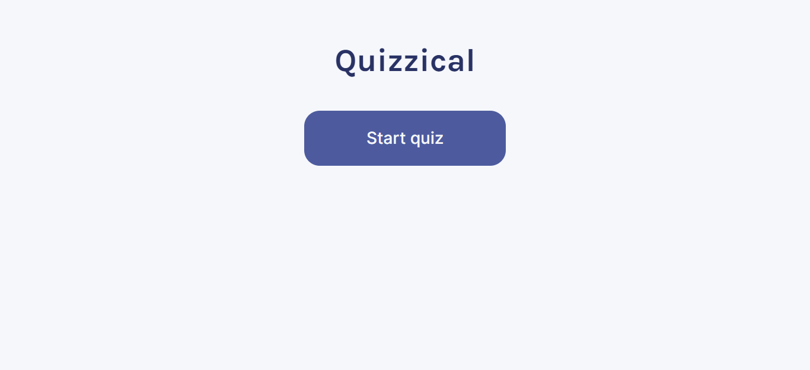
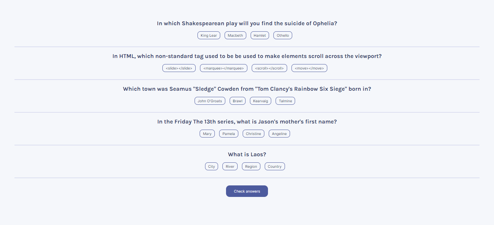
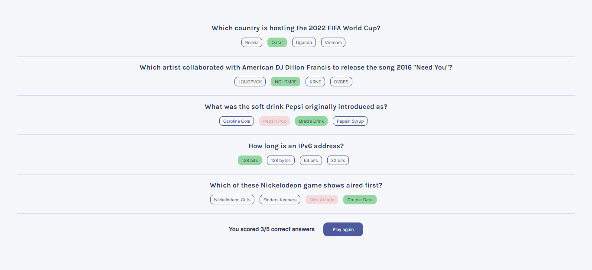

# Quizzical App

This is the final solo project from the course [Learn React for free](https://scrimba.com/learn/learnreact) on the coding course platform [Scrimba](https://scrimba.com).

## Link

- [Project url](https://scrimba-quizzical-app.netlify.app/) (hosted on Netlify)

## Screenshots

 

## Project

Users should be able to:

- Click on the 'Start quiz' button to see the questions
- Select the answer for each question
- Check if the answers are correct and see the correct answers in case they picked the wrong ones
- See how many correct answers they selected
- Restart the quiz

I used [ViteJS](https://vitejs.dev/) to bundle the files.

## Built with

- Semantic HTML5 markup
- CSS custom properties
- JavaScript
- React
- ViteJS
- [Open Trivia Database API](https://opentdb.com)

## Author

Chiara Stefanelli - Front-End Development Student based in Italy

- Website - [Chiara Stefanelli](https://chiarastefanelli.netlify.app/)
- LinkedIn - [Chiara Stefanelli](https://www.linkedin.com/in/chiarastefanelli/?locale=en_US)
